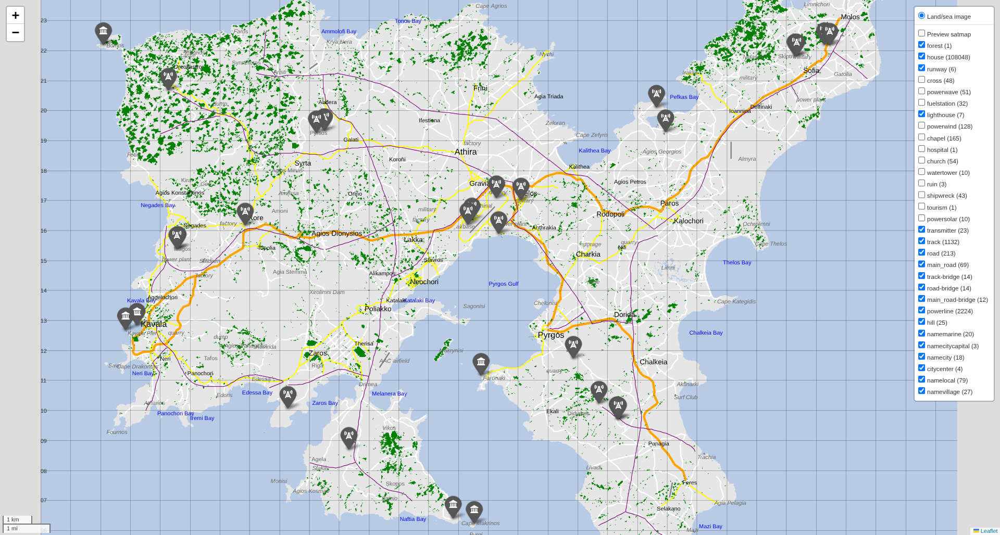
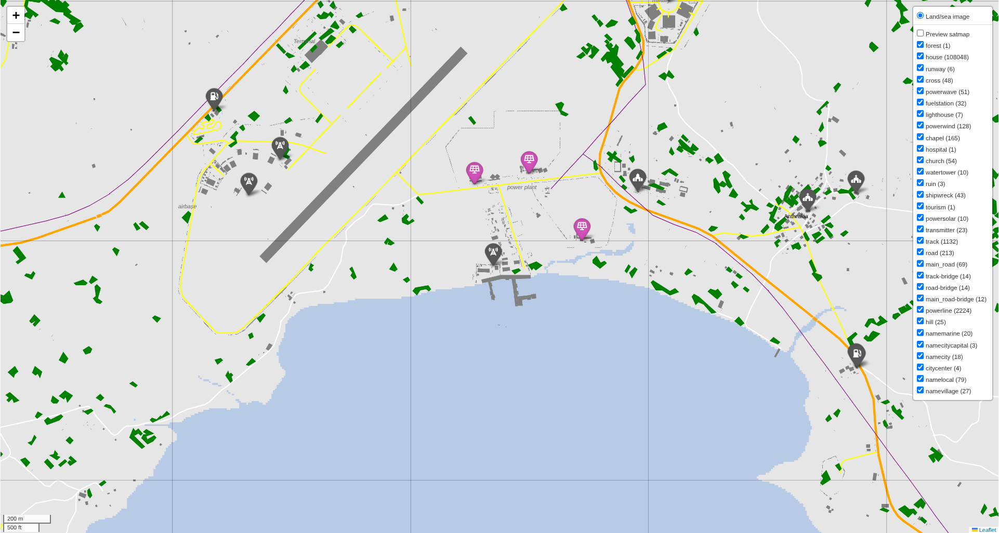

# arma3-leaflet-map

A proof of concept to create Arma 3 [Leaflet](https://leafletjs.com/) interactive maps
from [Gruppe Adler Map Exporter](https://github.com/gruppe-adler/grad_meh) ('grad_meh')
output.

Uses the [Folium](https://python-visualization.github.io/folium/) 
Leaflet library to produce the maps in Python.

**How is this different from [Arma3Map](https://atlas.plan-ops.fr/maps/arma3), 
which powers [PLANOPS Atlas](https://atlas.plan-ops.fr/maps/arma3)?**

- Utilizes more of Leaflet's capabilities; text and objects are vector graphics,
  not raster images
- More interactive; all layers can be toggled on/off
- No drawing/annotation tools
- No high-resolution satellite images
- Very much a work-in-progress

### Screenshots (v0.5.0)




## Prerequisites

A folder containing maps data exported with grad_meh.

## Installation

Clone the repo, e.g.:

```shell
git clone https://github.com/recreational-projects/arma3-leaflet-map
```
Create a Python environment and install the dependencies, e.g:
```shell
uv pip install .
```

## Usage
Edit `config.toml` so that:
- `input_relative_dir` points to the folder containing
  the grad_meh maps data
- `output_relative_dir` points to the folder where the maps should be saved

### To render a single map:
Edit `plot_map.py` so that `MAP_NAME` points to the required map, then:
```shell
uv run plot_map.py 
```

### To render all maps in the folder
```shell
uv run plot_all_maps.py 
```

Each map can take up to around 60&nbsp;s to produce.

## Output

Each Leaflet map is saved in `output_relative_dir` as a self-contained HTML file.
Open in a browser to view.

NB: the HTML files can be large, up to about 150&nbsp;MB.

### What's included in the maps

- A simple land/sea image
- A very low-res satellite image
- Layers for roads/tracks/trails, bridges, powerlines, railways,
  rivers, runways, forests, buildings
- Icon marker layers for each kind of point feature
- Text labels for each kind of location (settlements etc.)
- NB: to keep file sizes and HTML rendering time manageable, layers are excluded
  if they would contain more than 1000 objects