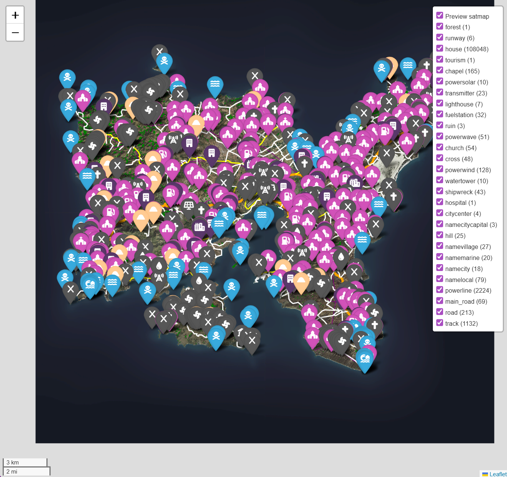

# arma3-leaflet-map

A proof of concept to create [Leaflet](https://leafletjs.com/) interactive maps
from Arma 3 maps. Uses [Folium](https://python-visualization.github.io/folium/)
to produce the maps in Python.

## Prerequisites

A folder containing maps data exported with
[Gruppe Adler Map Exporter](https://github.com/gruppe-adler/grad_meh) ('grad_meh').

## Installation

Clone the repo, e.g.:

```shell
git clone https://github.com/recreational-projects/arma3-leaflet-map
```
Create a Python environment and install the dependencies, e.g:
```shell
pip install .
````

or if you have uv installed:
```shell
uv pip install .
```

## Usage
- Edit `main.py` so that:
  - `INPUT_DATA_RELATIVE_DIR` points to the folder containing
    the grad_meh maps data
  - `OUTPUT_DIR` points to the folder where the maps should be saved
- Run `main.py` and note log messages
- Each HTML file represents a single Arma 3 map; open in a browser
- NB: the HTML files can be large, between 10 MB and 150 MB

## Screenshot



## What's included in the maps

- A very low-res satellite image
- Icon marker layers for each kind of point feature and location
- Layers for almost all other features: roads/tracks/trails, powerlines, railways,
  rivers, runways, forests, buildings 
- However, to keep file sizes and HTML rendering time manageable, layers are excluded
  if they would contain more than 1000 objects